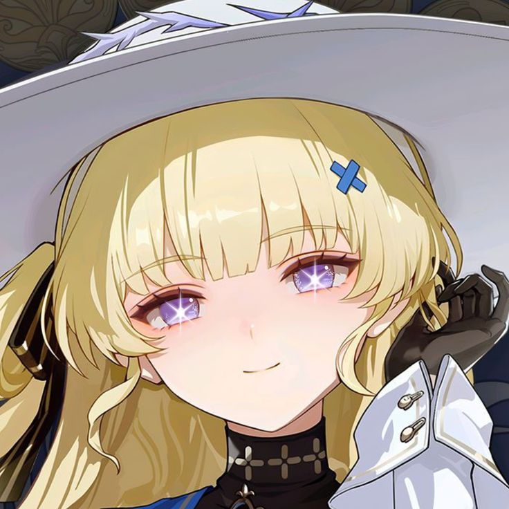

<div align="center">

<h1>Simple Tool Graphics Editor for anime games</h1>
</div>

# Tweak Graphics
With Simple GUI<br>
Do you want to contribute? Come its open source<br>

# Main Feature
- [ ] Detect game path Automatically
- [x] Backup the Engine.ini setting
- [x] Can Uncap 60 FPS
- [x] Can Modify game resolution
- [x] Set Distance scale Object
- [x] Disable/Enable shadow

# How To Use

- Download from [Release](https://github.com/GunahD/Graphics-Editor-for-Wuwa-game/releases) tab
- Place in Somewhere
- Run it (if needed run as administrator)
- Tweak

# Build From Source
Requierement
- python

# How to Run
- Clone this https://github.com/GunahD/Graphics-Editor-for-Wuwa-game.git
- Type this in Terminal
```sh
pyinstaller --onefile --windowed --add-data "appicon.ico;." --icon="appicon.ico" phoebeeditor.py
```

oh yeah use it at own risk!
