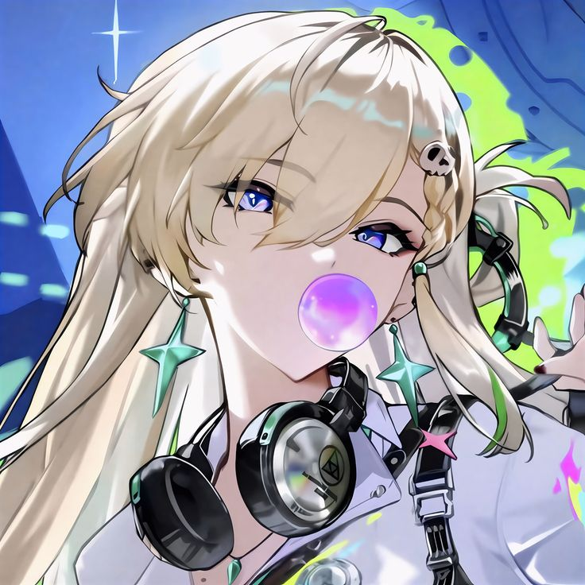

<h1>Simple Tool Graphics Editor for anime games</h1>

# Tweak Graphics
With Simple GUI 
 

# Main Feature
- [x] Detect Engine.ini Automaticaly
- [x] Backup the Engine.ini setting
- [ ] Can Uncap 60 FPS
- [x] Can Modify game resolution
- [x] Set Distance scale Object
- [x] Disable/Enable shadow

# How To Use

- Download from [Release](https://github.com/GunahD/Graphics-Editor-for-Wuwa-game/releases) tab
- Place in your Wuthering Waves files 

- Run it (if needed run as administrator)
- Tweak

oh yeah use it at own risk!
